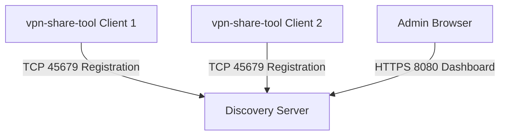

# Architecture

The **VPN Share Tool** is split into a desktop client application and a discovery server registry.

## High-Level Overview

The system consists of two primary applications:
1. **Client Application (`vpn-share-tool`)**: A desktop GUI application that users interact with to share URLs and view available services.
2. **Discovery Server (`discovery`)**: A central (or local) registry server that tracks active client instances and facilitates service discovery.

---

## Key Components

### 1. Client Application (`cmd/vpn-share-tool`)
* **Role**: The main user-facing tool. It acts as both a proxy server (forwarding traffic) and a client (consuming services).
* **Technology**: 
    * **Go (Golang)** for backend logic.
    * **Fyne** for the cross-platform desktop GUI (Windows, Linux, macOS).
* **Core Logic (`core/`)**:
    * **Proxy Engine**: Manages HTTP/HTTPS proxies. It can rewrite URLs and modify content (e.g., injecting scripts) to ensure proxied sites work correctly.
    * **Local API Server**: Each client starts a local HTTP server (defaulting to port `10081`+) to handle internal commands and status updates.
    * **Registration Manager**: Automatically finds the Discovery Server on the network and registers the client's presence.
* **Web Interface**:
    * **Debug Dashboard (`core/debug_web`)**: A built-in web interface (Vue.js) for inspecting captured requests and debugging proxy traffic (HAR support).

### 2. Discovery Server (`cmd/discovery`)
* **Role**: Maintains a registry of all active `vpn-share-tool` instances on the network.
* **Technology**: Go.
* **Communication**:
    * **TCP (Port 45679)**: Custom protocol for client registration and heartbeats. Handles TLS encryption.
    * **HTTP/HTTPS (Port 8080)**: Provides a web dashboard and API for viewing active instances and configuring global settings.
* **Web Interface**:
    * **Discovery Dashboard (`discovery_web`)**: A Vue.js-based admin panel to view active servers, shared proxies, and logs.

### 3. Build System (`dev/`)
* **Tooling**: A custom Go-based CLI tool wrapped by `dev.fish`.
* **Capabilities**:
    * Builds Go binaries for multiple platforms (Windows, Linux, Android).
    * Compiles Vue.js frontends (`npm run build`) and embeds them into Go binaries.
    * Handles CA certificate generation and injection.

---

## Data Flow & Communication

1. **Startup & Discovery**:
    * When the Client starts, it scans the local subnet (sending TCP probes) or uses fallback IPs to find the Discovery Server.
    * Upon connection, it performs a **TCP Handshake** (TLS-secured) to register its IP and API port.
    * It maintains a persistent **Heartbeat** connection.

2. **Sharing a Resource**:
    * User inputs a URL in the GUI.
    * The `core/proxy` module creates a local HTTP listener.
    * Traffic to this listener is proxied to the target URL, potentially with header/body modifications.

3. **Log Streaming**:
    * Clients stream internal logs to the Discovery Server via a **WebSocket** connection (`/upload-logs`).
    * Admins can view these logs in real-time on the Discovery Dashboard, which also connects via WebSocket.
    * The server maintains a memory buffer (last 1000 lines) for initial state on connection.

4. **Updates**:
    * The system supports auto-updates. Clients query the Discovery Server for the latest version and can trigger remote updates.
