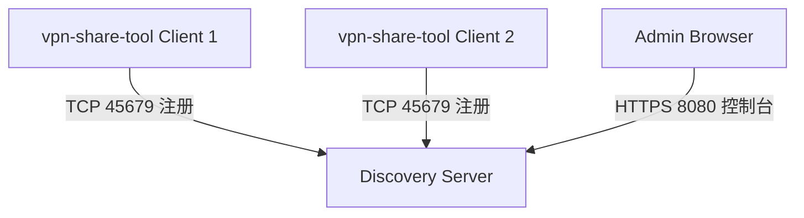

# 系统架构

**VPN Share Tool** 由桌面客户端应用程序和注册中心服务组成。

## 高层视图

系统包含两个主要应用程序：
1. **客户端应用程序 (`vpn-share-tool`)**：一个桌面 GUI 应用程序，用户可通过它共享 URL 并查看可用服务。
2. **注册服务 (`discovery`)**：一个中央（或本地）注册服务器，用于追踪活跃的客户端实例并协助服务发现。

---

## 核心组件

### 1. 客户端应用程序 (`cmd/vpn-share-tool`)
* **角色**：主要的用户交互工具。它既是代理服务器（转发流量），也是客户端（消费服务）。
* **技术栈**：
    * **Go (Golang)** 用于编写后端核心逻辑。
    * **Fyne** 用于编写跨平台的桌面 GUI（支持 Windows, Linux, macOS）。
* **核心逻辑 (`core/`)**：
    * **代理引擎 (Proxy Engine)**：管理 HTTP/HTTPS 代理。它能够重写 URL 并修改响应内容（例如注入 JS 脚本）以确保代理页面功能正常。
    * **本地 API 服务**：每个客户端启动一个本地 HTTP 服务（默认端口 `10081`+）来处理内部控制命令和状态更新。
    * **注册管理器 (Registration Manager)**：自动在网络中发现注册服务器（Discovery Server）并注册当前客户端。
* **Web 界面**：
    * **调试控制台 (`core/debug_web`)**：内置的网页端交互界面（Vue.js），用于审查捕获到的请求并调试代理流量（支持 HAR 导出与对比）。

### 2. 注册服务 (`cmd/discovery`)
* **角色**：维护局域网内所有活跃 `vpn-share-tool` 客户端的实例注册表。
* **技术栈**：Go。
* **通信协议**：
    * **TCP (端口 45679)**：用于客户端注册和心跳检测的自定义协议，使用 TLS 加密。
    * **HTTP/HTTPS (端口 8080)**：提供 Web 仪表盘和 API，用于查看活跃的客户端以及配置全局属性。
* **Web 界面**：
    * **注册中心控制台 (`discovery_web`)**：基于 Vue.js 的管理面板，展示活跃的服务器、共享的代理以及实时日志。

### 3. 构建系统 (`dev/`)
* **工具链**：包装在 `dev.fish` 中的自定义 Go 编写的 CLI 开发命令工具。
* **功能**：
    * 交叉编译构建多个平台（Windows, Linux, Android）的 Go 二进制文件。
    * 自动编译 Vue.js 前端代码（`npm run build`）并将资源静态嵌入到 Go 二进制文件中。
    * 处理 CA 证书的生成和分发注入。

---

## 数据流与通信机制

1. **启动与发现**：
    * 客户端启动时，会自动扫描本地子网（发送 TCP 探测）或使用硬编码的备用 IP 来寻找注册服务服务器。
    * 连接成功后，它执行 **TCP 握手**（基于 TLS）注册自己的 IP 和 API 端口。
    * 它与服务端保持一条持久的 **心跳 (Heartbeat)** 连接。

2. **共享资源**：
    * 用户在客户端 GUI 中输入需要代理的 URL。
    * `core/proxy` 模块创建一个本地 HTTP 监听端口。
    * 该端口的流量被代理转发到目标 URL，其间可能会经过请求头或响应体的重写修改。

3. **日志推流**：
    * 客户端通过 **WebSocket** 连接（`/upload-logs`）向注册中心服务器推流本地日志。
    * 管理员可以通过注册中心控制台（同样通过 WebSocket 协议连接）实时查阅这些汇总日志。
    * 注册中心保持 1000 行的日志内存缓冲区，方便新建立连接的控制台查看初始状态。

4. **系统更新**：
    * 系统支持自动升级。客户端定期从注册中心获取最新版本信息，并可触发远程自动更新。
