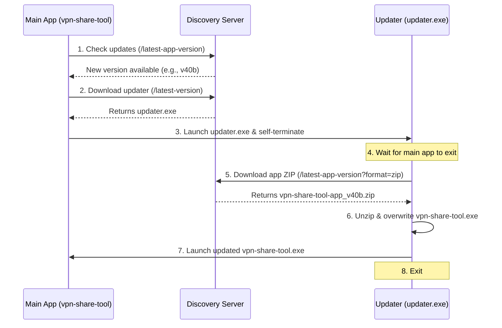

# Windows Updater Architecture & Release Guide

To solve Windows file-locking issues, anti-virus alerts, and package size overhead, the auto-update pipeline uses a dedicated, lightweight **console-based updater** separate from the main application.

---

## 1. How the Updater Works (Architecture)

The update flow is split into a **two-step bootstrap process** to cleanly replace locked files:



### Modes of Operation
1. **Bootstrap Mode**: When the updater is executed with the name `vpn-share-tool.exe` (such as when legacy clients directly replace their main executable with the updater file), it copies itself to `updater.exe`, spawns `updater.exe --source vpn-share-tool.exe`, and exits immediately.
2. **Upgrade Mode**: Running as `updater.exe` with a `--source` flag, it waits for the main application process to exit and release file locks, downloads the zip release of the actual application, extracts/overwrites the target binary, and restarts the application.

---

## 2. Updater vs. Main App Differences

| Feature | Main Application (`vpn-share-tool`) | Updater (`updater.exe`) |
| :--- | :--- | :--- |
| **Role** | GUI proxy sharing & client dashboard | Lightweight binary replacement agent |
| **Interface**| Fyne Desktop GUI (Interactive) | Console (CLI outputs, progress bars) |
| **Size** | ~64 MB | ~6.5 MB |
| **Go Version**| `go >= 1.25` (Required by Sentry) | `go 1.24` / pure Go |
| **CGO** | Enabled (OpenGL / graphics drivers) | Disabled (`CGO_ENABLED=0`) |
| **Release File**| `vpn-share-tool-app_vXX.zip` | `vpn-share-tool_vXX.exe`, `vpn-share-tool_vXX.zip` |

---

## 3. Build & Release Commands

All compilation and publishing tasks are managed by the custom development CLI (`go run ./dev`).

### A. The Updater Binary
To build and release updates to the updater binary itself (e.g., when improving the updater's unzip logic):

1. **Build**:
   ```bash
   go run ./dev build updater
   ```
   This generates `dist/updater.exe` (~6.5MB) using compile-time optimization flags (`-trimpath` and `-ldflags="-s -w"`).

2. **Release**:
   ```bash
   go run ./dev release-windows --updater
   ```
   Copies the updater executable and its ZIP package (renamed to `vpn-share-tool_vXX.exe` and `vpn-share-tool_vXX.zip`) to the Samba share path. **No hash (`.sha256`) files are uploaded** to maintain backwards compatibility with legacy client versions (e.g., `37b`).

### B. The Main Application
To build and release updates to the main application:

1. **Build**:
   * **Local build** (using local mingw-w64 toolchain):
     ```bash
     go run ./dev build windows --local
     ```
   * **Container build** (using `fyne-cross` Docker image):
     ```bash
     go run ./dev build windows
     ```
   This bumps the version count, embeds frontend assets, and generates the application executable.

2. **Release**:
   ```bash
   go run ./dev release-windows
   ```
   Compresses the application into `vpn-share-tool-app_vXX.zip` and uploads it to the Samba share alongside its `.sha256` integrity verification file. **Only the `.zip` archive is uploaded for the app** to optimize network traffic and disk usage on the share.
