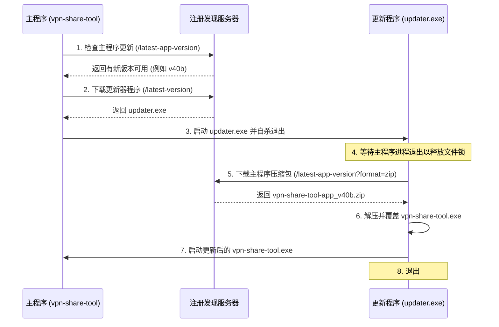

# Windows 更新程序 (Updater) 架构与发布指南

为了解决 Windows 文件锁占用、杀毒软件误报以及包体体积过大的问题，自动更新流程采用了一个独立的、轻量级的 **控制台更新程序 (Console Updater)**，与主程序完全分离。

---

## 1. 更新程序工作原理 (系统架构)

更新流程采用 **两步引导程序 (Bootstrap Process)** 来安全地替换被锁定的可执行文件：



### 运行模式
1. **引导模式 (Bootstrap Mode)**：如果更新器本身以 `vpn-share-tool.exe` 命运行（例如旧版本客户端直接用更新器文件覆盖主程序的情况），它会复制自身到 `updater.exe`，启动子进程 `updater.exe --source vpn-share-tool.exe`，然后立即退出。
2. **升级模式 (Upgrade Mode)**：以 `updater.exe` 文件运行并带有 `--source` 参数。它会等待主程序释放文件锁，下载主程序的 ZIP 压缩包进行解压和覆盖，最后重新拉起主程序。

---

## 2. 更新程序与主程序的区别

| 特性 | 主程序 (`vpn-share-tool`) | 更新程序 (`updater.exe`) |
| :--- | :--- | :--- |
| **角色** | 代理资源共享与客户端 GUI 交互面板 | 轻量级文件替换代理 |
| **界面** | Fyne 桌面 GUI (交互式) | 控制台 (命令行输出与进度条) |
| **大小** | 约 64 MB | 约 6.5 MB |
| **Go 版本**| `go >= 1.25` (Sentry 库依赖) | `go 1.24` / 纯 Go 标准库 |
| **CGO** | 开启 (包含 OpenGL 图形驱动依赖) | 关闭 (`CGO_ENABLED=0`) |
| **发布包** | `vpn-share-tool-app_vXX.zip` | `vpn-share-tool_vXX.exe`, `vpn-share-tool_vXX.zip` |

---

## 3. 构建与发布命令

所有的编译与分发操作均由自定义开发命令行工具 (`go run ./dev`) 统一管理。

### A. 更新器 (Updater) 自身
用于编译和发布更新器本身的修改（例如修改了解压逻辑或命令行交互）：

1. **构建**：
   ```bash
   go run ./dev build updater
   ```
   该命令会从 `Release.toml` 读取当前版本，应用 `-trimpath` 与 `-ldflags="-s -w -X main.UpdaterVersion=vXX"` 编译参数，进行编译优化并动态注入版本号，在 `dist/` 目录下生成约 6.5MB 的 `updater.exe`。这能确保更新程序明确知道自身的版本，避免陷入无限更新循环。

2. **发布**：
   ```bash
   go run ./dev release-windows --updater
   ```
   将更新程序可执行文件及 ZIP 包（重命名为 `vpn-share-tool_vXX.exe` 和 `vpn-share-tool_vXX.zip`）拷贝到共享目录。**此处不上传 `.sha256` 校验文件**，以确保旧版本（如 `37b`）客户端可以顺利下载并直接引导升级。

### B. 主程序 (Main Application)
用于编译和发布主程序的业务更新：

1. **构建**：
   * **本地构建**（使用本地 mingw-w64 交叉编译工具链）：
     ```bash
     go run ./dev build windows --local
     ```
   * **容器构建**（使用 `fyne-cross` Docker 镜像）：
     ```bash
     go run ./dev build windows
     ```
   构建过程会自动累加版本号，编译打包前端静态资源并嵌入二进制中。

2. **发布**：
   ```bash
   go run ./dev release-windows
   ```
   将主程序打包成 `vpn-share-tool-app_vXX.zip` 并上传至共享目录，同时写入用于校验文件完整性的 `.sha256` 文件。**主程序只发布 ZIP 格式**，以大幅节省共享目录存储空间并降低网络带宽消耗。

---

## 4. 客户端迁移与后向兼容指南

随着新版本客户端移除了独立的 `updater.exe`，并改回直接使用 `update.bat` 的逻辑，我们需要分两步进行平滑迁移，以保证与各个历史版本（极旧版本如 `v37b`，中代版本如 `v38` - `v40c` 以及全新版本客户端）的完全兼容：

### 阶段一：极旧版本客户端（例如 `v37b`）
- **行为**：这些客户端直接向 `/latest-version?format=zip` 请求主程序的更新包。
- **迁移逻辑**：当它们下载到 `vpn-share-tool_vXX.zip`（实际为重命名为 `vpn-share-tool.exe` 的更新器程序）并解压运行时，更新器会检测到自身文件名不是 `updater`，从而进入**引导模式 (Bootstrap Mode)**：复制自身到 `updater.exe` 并启动子进程，随后由该子进程请求 `/latest-app-version` 并下载解压 `vpn-share-tool-app_vXX.zip`（新版主程序）覆盖自身。

### 阶段二：中代版本客户端（如 `v38` - `v40c`）
- **行为**：这些客户端向 `/latest-app-version` 请求主程序更新，但会通过下载 `/latest-version` (即 `updater.exe`) 来执行覆盖安装。
- **迁移步骤 1 (全网客户端换代)**：发布带有 `-app` 后缀的新主程序包（如 `vpn-share-tool-app_v40d.zip`）。中代客户端的 `updater.exe` 会自动下载、解压并将其升级至 `v40d`。在此次升级后，**全网已无存活的使用 `updater.exe` 的客户端**，后续全部切换至 `update.bat` 直更逻辑。
- **迁移步骤 2 (回归标准包名)**：在全网客户端均升级至 `v40d` 或更高版本后，后续的新版本（如 `v41a`）可以直接发布为标准包名 `vpn-share-tool_v41a.zip`。注册发现服务器会自动应用回退匹配机制，当客户端请求 `/latest-app-version` 时会同时检索 `-app` 和标准包名，返回最新版本。
